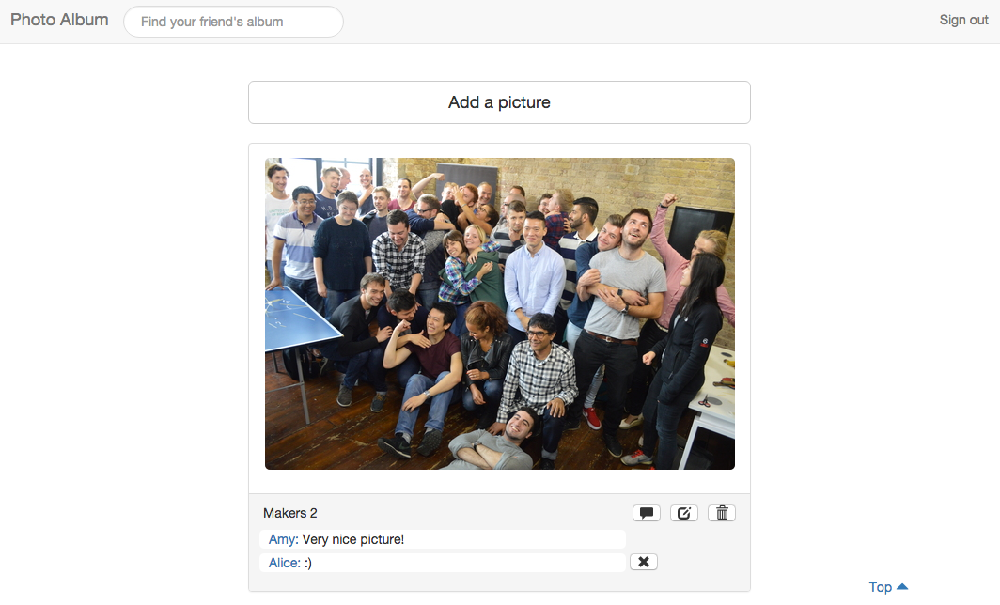
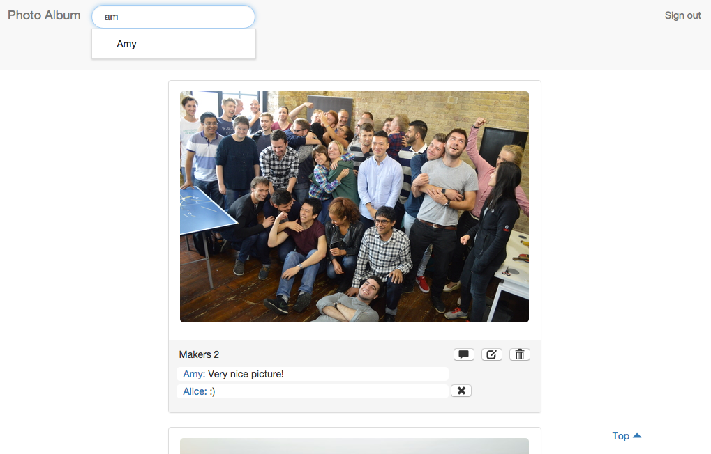
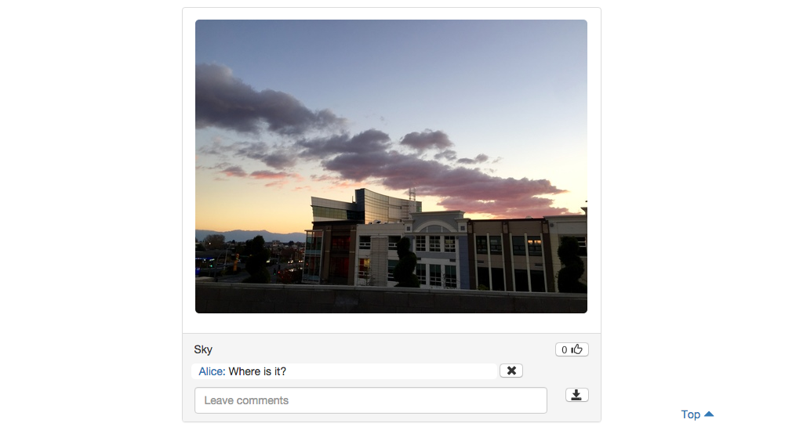

# Photo Album

This is a photo-sharing web application where users can post their pictures and interact with their friends. Users' photos are stored in amazon s3.



Users can search their friend using autocomplete. By clicking their friend's name, they can visit their friend's album.



Users can leave comments right under each picture. They can also click the like button.



Demo
----
Visit https://photo--album.herokuapp.com/

Use the email and password below if you don't want to sign up.
* email: alice@test.com/
password: password

* email: amy@test.com/
password: password

Getting Started
-----
```
$ git clone git@github.com:jongmin141215/instagram.git
$ cd instagram
$ bundle
$ rake db:create
$ rake db:migrate
$ rails s
```

Visit http://localhost:3000


Running tests
------
To run RSpec:
```
$ rspec
```

Features
-----
* Users can post their pictures with description.
* Users can search friends' album and leave comments.
* Users can like their friends' pictures.

Still to do
------
* Implement responsive design

Technologies
-----
* Web Framework: Rails
* Testing: RSpec, Capybara, Poltergeist
* Hosting: Heroku
* Persistence: ActiveRecord
